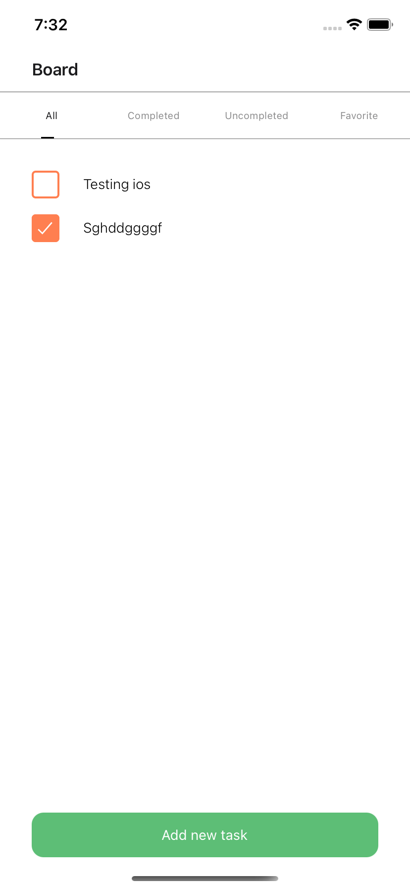
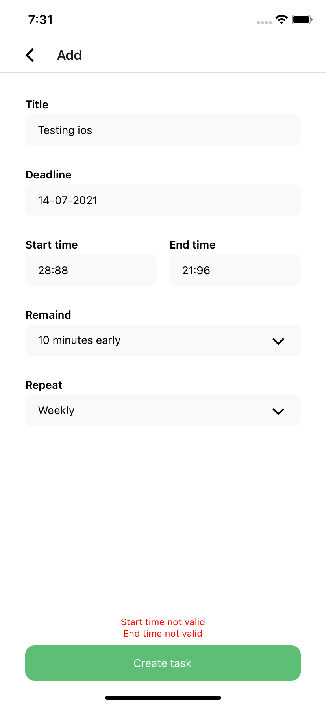
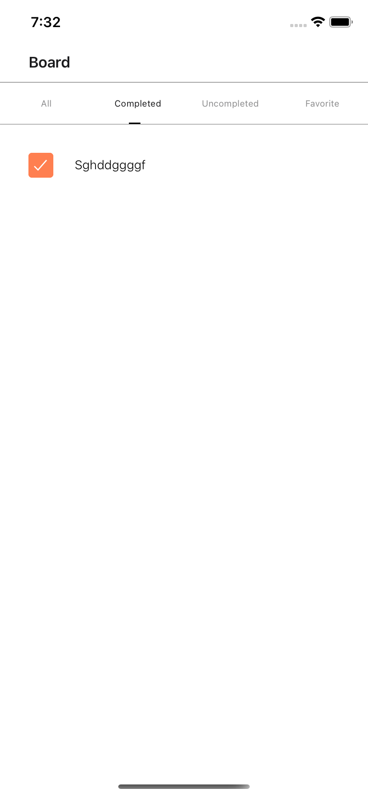
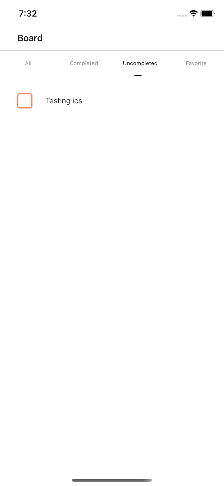
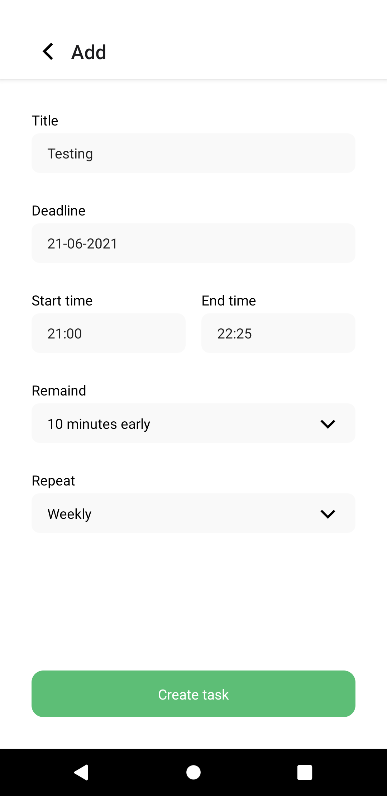
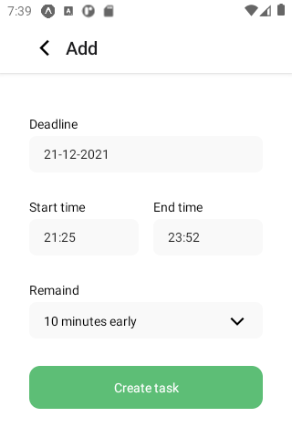

# Test to Puzzle

**Editor:** [Cristian Ronda](https://cristian-ronda.tk/)

**Email:** cristian.ronda.dev@gmail.com

**Date:** 5th july 2021

Download my resumen in [English](https://drive.google.com/file/d/1NUGIBupzp4uJ69JeYrBevXJYJFlTHdbJ/view?usp=sharing) or [Spanish](https://drive.google.com/file/d/1Y3OP2mqZHTziH7EATBho3DFLeIfXo7-Z/view?usp=sharing)

# Description

This project has a React Native code for apply in Puzzle Company.

# Libraries and frameworks

- React Native
- Redux
- TypeScript
- Expo
- Async storage
- React Navigation

# Structure

The code is on src/ folder

- App.tsx: entrypoint of app
- components: UI components in page
- constants: values that not change
- containers: components with screen logic
- hooks: hooks into project
- navigation: navigation of app (Stack and Top Tabs)
- redux: reducers, actions types and store of redux
- utils: regex to validate dates and validate form
- theme: has colors
- types: types of app
- views: has a layouts (has only UI)

# How to run

1. Install dependencies

```bash
    yarn install

    or

    npm i
```

2. Run command

```bash
    yarn start
```

3. Go to [localhost:19002](http://localhost:19002/)

# Screenshots

## Task






## Responsive

On iOS, Android and small Android




